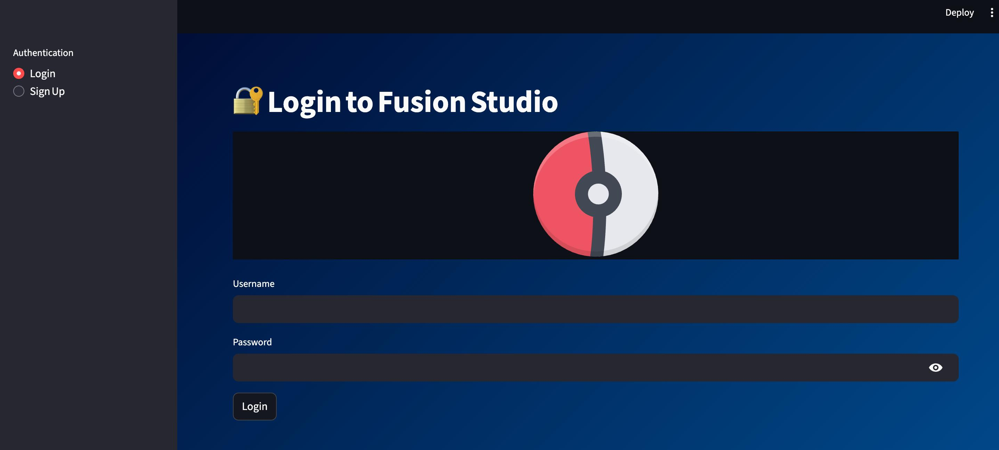

# FusionX AI Analytics Studio

FusionX AI Analytics Studio is a modern, interactive analytics and ML platform built with Streamlit, Python, and SQLite. It enables seamless data upload, SQL ETL, dashboards, EDA, predictive modeling, and PDF reporting—all through a user-friendly web interface.

---

## 🚀 Features

- Secure login & user sessions
- Smart CSV upload (auto SQLite ingestion)
- Visual ER diagrams and SQL Studio
- Intuitive EDA: histograms, boxplots, summary stats, correlation heatmap
- KPIs dashboard with filters & trendlines
- Built-in ML: linear regression, outlier detection (Isolation Forest)
- AI-generated PDF summary reporting
- Cloud/deployment ready

---

## 📷 Screenshots

### Login & Upload

### SQL Studio & ER Diagram

### EDA & Analytics Dashboard

### Machine Learning

### PDF/Reporting

_Update screenshot names/paths as needed for your files!_

---

## ⚡ Quick Start

1. **Clone the repo:**
